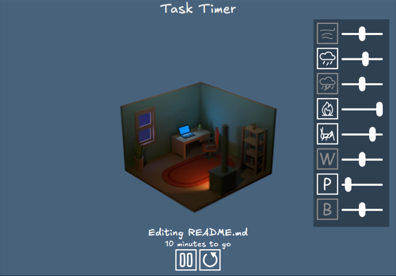

# Task Timer

A Pomodoro-type timer with additional ambient sounds written in JavaScript.

> Note: My main purpose for this project is to familiarise myself more with GitHub Workflow and GitHub Projects - the initial commit (2025-02-23) is an unfinished version of the application.

## Credits and Licenses for used assets

### Ambient sounds used under the Pixabay license ([Link to the License](https://pixabay.com/service/license-summary/))

Wind blowing though Trees - Traian1984 [Link to the original file](https://pixabay.com/sound-effects/ambience-wind-blowing-through-trees-01-186986/),  
Calming Rain - Liecio [Link to the original file](https://pixabay.com/sound-effects/calming-rain-257596/),  
Rain - DonRain [Link to the original file](https://pixabay.com/sound-effects/rain-110508/),  
Fireplace - aunrea (Freesound) [Link to the original file](https://pixabay.com/sound-effects/fireplace-6160/),  
Crickets - FreeSound Community [Link to the original file](https://pixabay.com/sound-effects/crickets-17862/),

### Resources used under the Creative Commons CC0 license ([Link to the License](https://creativecommons.org/publicdomain/zero/1.0/))

3d Assets used for the backgoubd image render - KenneyNL [Link to the original resource](https://kenney.nl/assets/furniture-kit),  

### Resources used under the MIT license ([Link to the License](https://mit-license.org/))

Excalifont [Link to the original resource](https://plus.excalidraw.com/excalifont)

## License

MIT License

Copyright (c) 2025 Sebastian Włodarczyk

Permission is hereby granted, free of charge, to any person obtaining a copy
of this software and associated documentation files (the "Software"), to deal
in the Software without restriction, including without limitation the rights
to use, copy, modify, merge, publish, distribute, sublicense, and/or sell
copies of the Software, and to permit persons to whom the Software is
furnished to do so, subject to the following conditions:

The above copyright notice and this permission notice shall be included in all
copies or substantial portions of the Software.

THE SOFTWARE IS PROVIDED "AS IS", WITHOUT WARRANTY OF ANY KIND, EXPRESS OR
IMPLIED, INCLUDING BUT NOT LIMITED TO THE WARRANTIES OF MERCHANTABILITY,
FITNESS FOR A PARTICULAR PURPOSE AND NONINFRINGEMENT. IN NO EVENT SHALL THE
AUTHORS OR COPYRIGHT HOLDERS BE LIABLE FOR ANY CLAIM, DAMAGES OR OTHER
LIABILITY, WHETHER IN AN ACTION OF CONTRACT, TORT OR OTHERWISE, ARISING FROM,
OUT OF OR IN CONNECTION WITH THE SOFTWARE OR THE USE OR OTHER DEALINGS IN THE
SOFTWARE.
